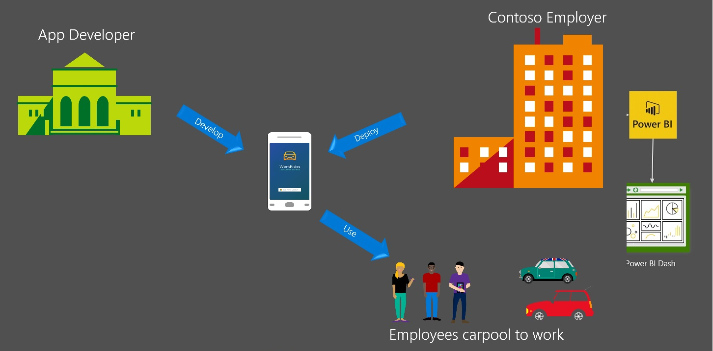

# Build End-to-End Solutions Using Microsoft Graph and Common Data Service

## Overview
> **NOTE** This is an end-to-end solution published as part of the Microsoft Build 2017 session [P4136](https://channel9.msdn.com/Events/Build/2017/P4136). This contains multiple projects that use Microsoft Graph and Common Data Service, Xamarin technologies.

Microsoft provides a platform for building end-to-end solutions. This sample show cases how professional developers can build people centric, data rich apps that leverage productivity and business data from [Microsoft Graph](https://graph.microsoft.com "Microsoft Graph") and [Common Data Service](https://aka.ms/CommonDataService "Microsoft Common Data Service"). And how power users can leverage that data further to create apps, flows, and dashboards.

[Microsoft Graph](https://graph.microsoft.com "Microsoft Graph") is the unified API for Microsoft services. That includes Office 365, Azure Active Directory, and many others.

[Microsoft Common Data Service](https://aka.ms/CommonDataService "Microsoft Common Data Service") or CDS is a focal point for a business's data. Professional developers can write applications that interact with that data in CDS and power users can take advantage of PowerApps, Flow, and PowerBI to create apps, design workflows, and perform deep analytics over that data without writing any code.

Microsoft Graph gives you access to rich data from Microsoft services. Once you bring that data to CDS, you can combine it with other business data that your business depends on. Then you can build rich applications and workflows with easy to use building blocks (such as [PowerApps](https://powerapps.microsoft.com/en-us/), [Flow](https://flow.microsoft.com/en-us/), [PowerBI](https://powerbi.microsoft.com/en-us/)) whether you know how to write code or not. So using Microsoft Graph and Common Data Service developers can not only build people centric, data rich apps but the app can be extended by power users who are not regular coders to have additional experiences.

## What scenarios are covered by this sample?
The samples published as part of this project are built based on the following scenario:

### Professional app developer scenario
Many companies face problems facilitating commuting and parking for their employees. They're looking for solutions. A professional app developer is working to solve this problem. She builds a mobile app that helps people find rides to and from work. This app fits well into how people actually work. and since this app can be deployed in many companies.

### Enterprise power users scenario
Contoso is one of the first customers to acquire this app and make it available to all its employees. Contoso's power users (typically non professional coders such as a HR person) easily extend the data created by this app to build additional experiences.

## What is included in this project?

Please follow through the links provided below to learn how the individual pieces have been built and recreate the end-to-end experience for yourself.

### Professional app developer - build an application using code
- [Mobile App](./mobileapp/README.md) - Xamarin Forms apps that uses Microsoft Graph APIs to get people data and stores in Common Data Service via Web API.

### Enterprise power users - leverage data and extend a solution using no code
- [CDS](./cds/README.md) - The Common Data Service is used as the data repository for the Mobile App and that data is further leveraged by PowerApps, Flow, and PowerBI.
- [PowerApps App](./powerapps/README.md) - PowerApps app built by an enterprise power user who uses Excel like expression language to build a LOB mobile app with out knowing to write code.
- [Flow](./flow/README.md) - Expense approval workflow built by an enterprise power user that uses Microsoft Flow which sends approval emails to the manager and other departments.
- [PowerBI dashboard](./powerbi/README.md) - A dashboard built by an enterprise power user that helps analysing the ride share data.

### Technical overview

## Learn more
- [Microsoft Graph](https://graph.microsoft.com "Microsoft Graph")
- [Microsoft Common Data Service](https://aka.ms/CommonDataService "Microsoft Common Data Service")
