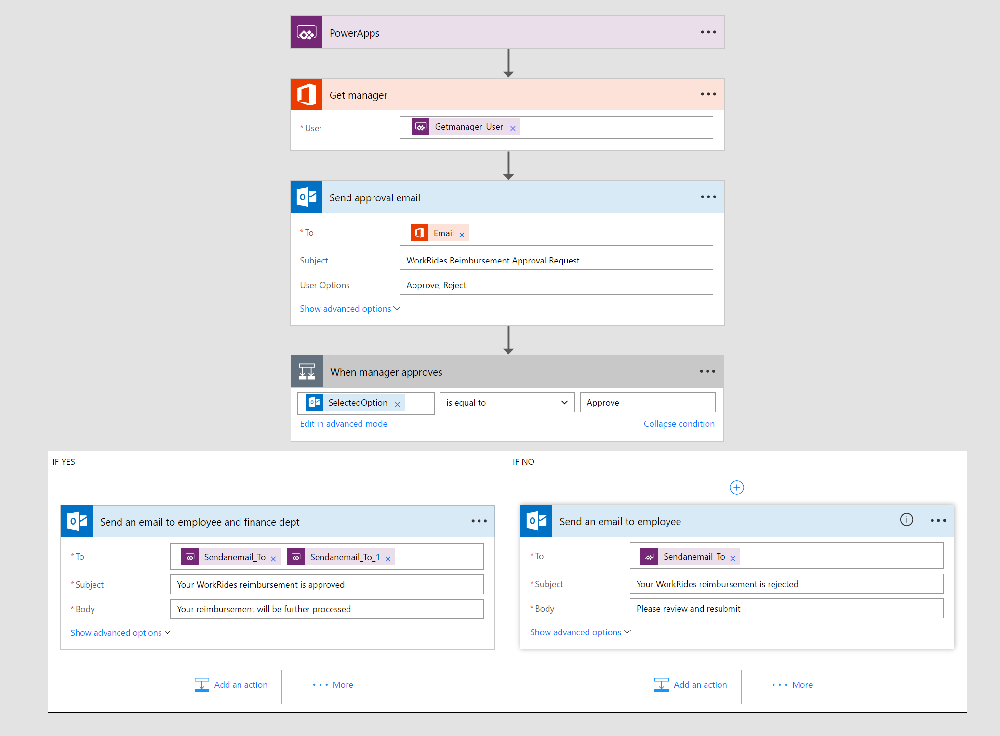

# Overview

Using [Microsoft Flow](https://flow.microsoft.com/en-us/), you can set up automated workflows between your favorite apps and services to synchronize files, get notifications, collect data, and more. The basic building blocks needed to build Flows are [Connectors](https://flow.microsoft.com/en-us/services/).

The flow built as part of this sample triggers the reimbursement approval notification. When employees submits their expense reimbursement request from the PowerApps app this flow is triggered which sends mail to the employee's manager and upon manager's approval mail is sent to the conserned department for further processing the reimbursement. If the manager rejects the expense employee is notified.

# Connectors
The basic building blocks needed to build Flows are Connectors. The list of Connectors used in this Flow are:

1. Get Manager step uses the [Office 365 Users](https://flow.microsoft.com/en-us/services/shared_office365users/office-365-users/) Connector which uses Microsoft Graph APIs to get the employee's manager 
2. [Office 365 Outlook](https://flow.microsoft.com/en-us/services/shared_office365/office-365-outlook/) Connector is used to trigger approval emails and also to send mails to employees

> **Note** For such approval process a new improved [Modern Approval](https://flow.microsoft.com/en-us/blog/introducing-modern-approvals/) Connector is recommended. This sample will be updated to use the Modern Approval Connecter in the coming weeks.

# How did we build this flow?
We created this flow on the [Microsoft Flow](https://flow.microsoft.com/en-us/) website. The Flow designer helps adding various steps and configure the connectors with out requiring to write any code.

## Step 1: PowerApps
The first step of the Flow is a trigger. In this case we added PowerApp Connector that triggers this flow and passes employee name, reimbursement data in variables that will be used in the subsequent steps.

## Step 2: Get manager
In this step the [Office 365 Users](https://flow.microsoft.com/en-us/services/shared_office365users/office-365-users/) connector gets the employee's manager's email based on the employee's email obtained from the previous step.

## Step 3: Send approval email
In this step the [Office 365 Outlook](https://flow.microsoft.com/en-us/services/shared_office365/office-365-outlook/) connector is configured to send approval email to the employee's manager that was obtained from the previous step. We configured this connector to include the expense data that came from the PowerApps step. When sending an email this connector adds "Approve", "Reject" buttons to help managers to approve or reject right from their email.

## Step 4: Notify employee and others
In this step the [Office 365 Outlook](https://flow.microsoft.com/en-us/services/shared_office365/office-365-outlook/) connector is configured to notify employees and finance dept based on the action the manager takes by clicking Approve or Reject buttons from their email.

