# WorkRides Mobile App

## Table of Contents.
* [Introduction](#introduction)
* [Requirements](#requirements)
* [Mobile App (Xamarin Forms App)](#Mobile-App-Xamarin-Forms-App)
* [Setup](#setup)
* [App Registration](#App-Registration)
* [Clean and Rebuild](#Clean-and-Rebuild)
## Introduction
The mobile app described here uses [Microsoft Graph](https://graph.microsoft.com/) APIs to get people data and stores in [Common Data Service](https://aka.ms/CommonDataService) via Web API. This mobile app connects people to carpool to work. Users can sign in to the app using their work identities (AAD) and find other employees in their org and/or the people they closely work with to Carpool to work.

This app demonstrates that professional developers are able to build people centric, data rich apps with their platform of choice using [Microsoft Graph](https://graph.microsoft.com/) APIs and [Common Data Service](https://aka.ms/CommonDataService).

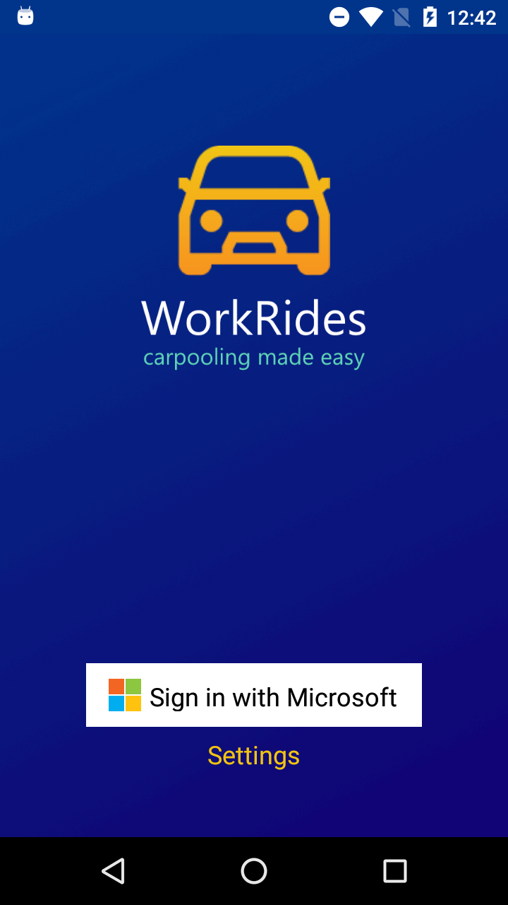 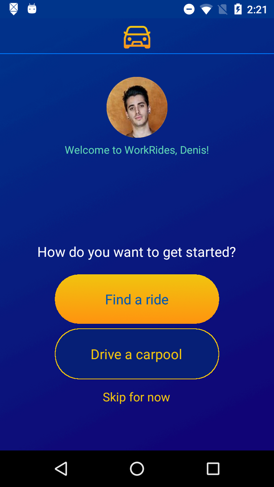 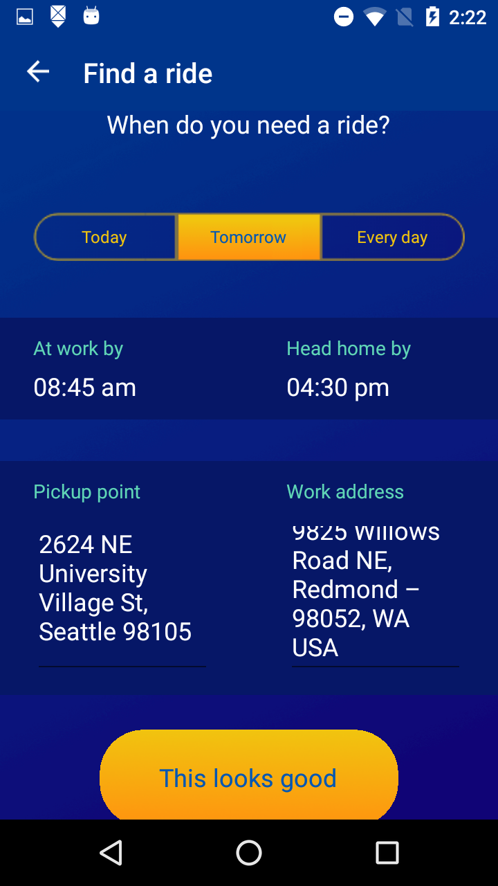 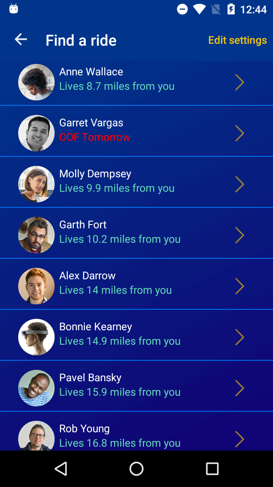 

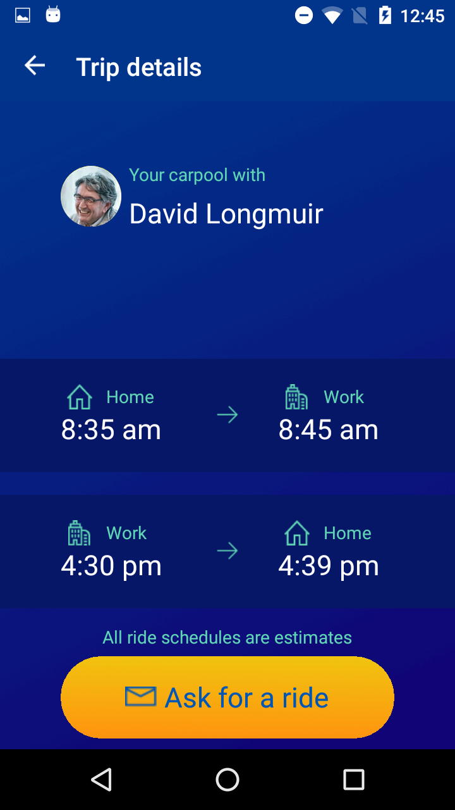 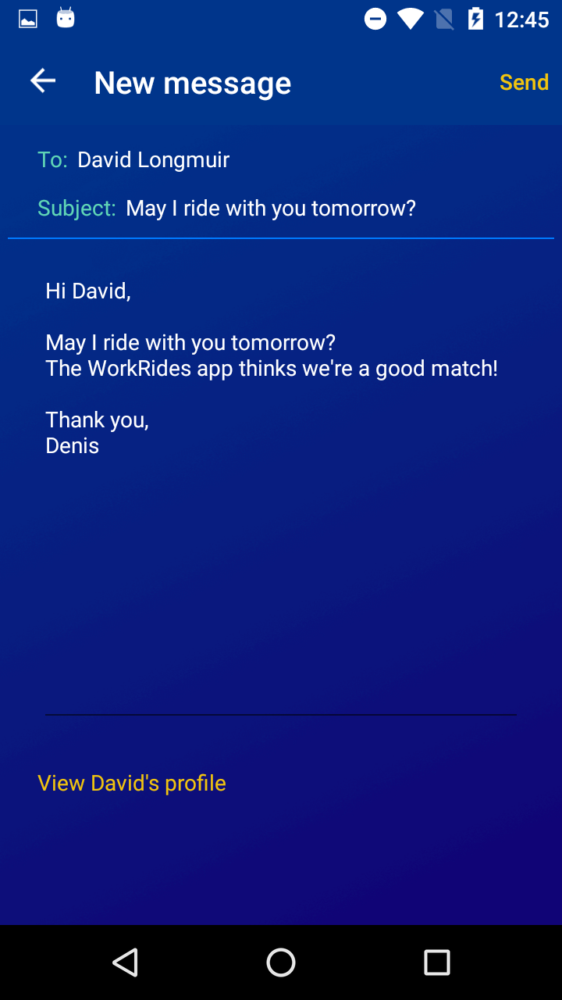  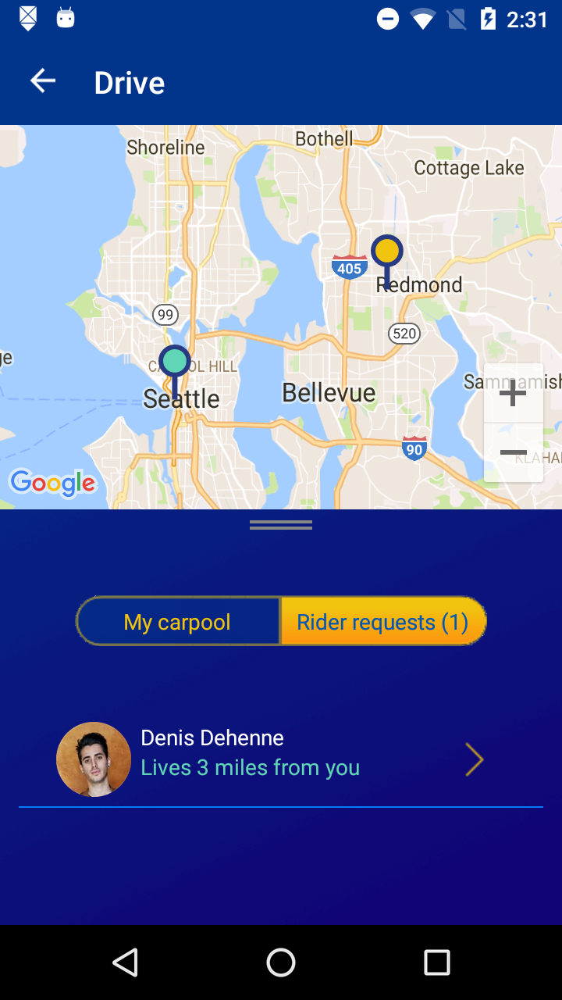 

 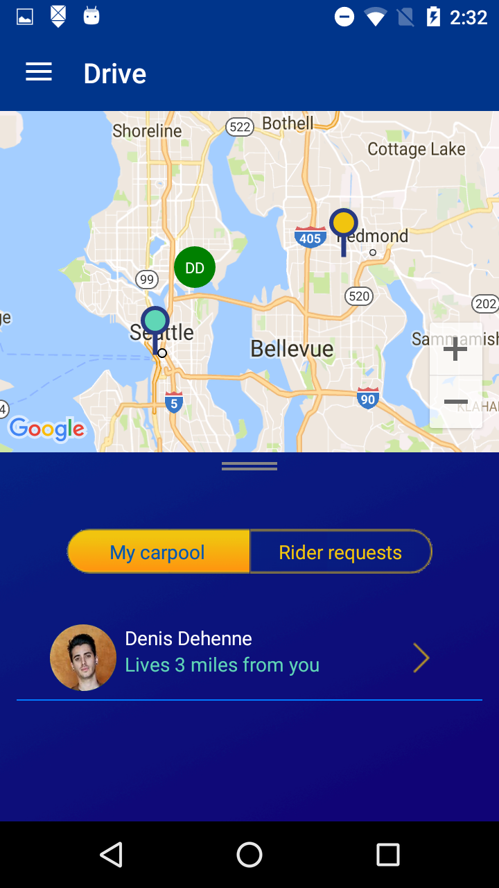 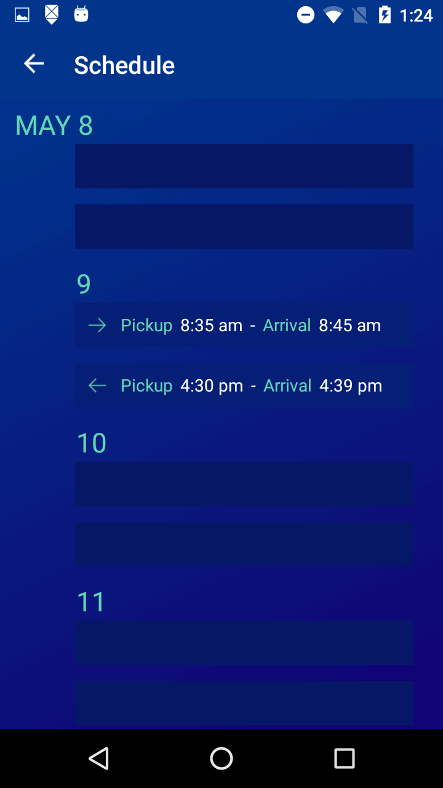 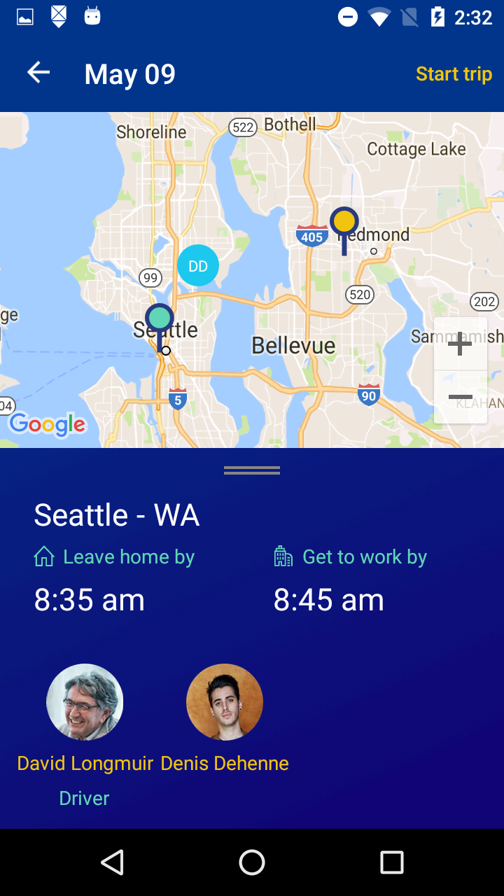


## Requirements
* Windows 10
* [Visual Studio __2015__](https://www.visualstudio.com/en-us/products/vs-2015-product-editions.aspx) Update 3 (14.0 or higher) to compile C# 6 language features (or Visual Studio MacOS) or Visual Studio 2017
* Xamarin add-ons for Visual Studio 3.2.1.64 or higher (available via the Visual Studio installer)
* __Visual Studio Community Edition is fully supported!__
* [Android SDK Tools](https://developer.android.com/studio/releases/sdk-tools.html) 25.2.3 or higher

## Mobile App (Xamarin Forms App)
This project exercises the following platforms, frameworks or features:

### Xamarin.Forms
  * XAML
  * Bindings
  * Converters
  * Central Styles
  * Custom Renderers
  * Animations
  * IoC
  * Messaging Center
  * Custom Controls
  * Cross Plugins

### Three platforms
The app targets **three** platforms:

* iOS (include WatchOS App)
* Android
* Universal Windows Platform (UWP)
    * UWP supported only in Visual Studio, not Xamarin Studio

As of 06/05/2017, WorkRides features 88.6% code share (11% iOS / 11.2% Android / 11.6% Windows).

## Setup
- **Download** or clone the repository.
- **Rebuild** the WorkRides.sln solution to get all necessary **NuGet** packages.

This app will run as is with the preconfigured settings so that you can try and learn how it works. You can use alexa@fabrikamco.onmicrosoft.com (pass: Microsoft2017) to run the app as soon as you build to see how it works with sample data.

If you want to plug your tenant data you need to edit **AppSettings.cs** file which is part of the Portable Class Library to update the settings with the values specific to your environment.

The following sections will walk you through the steps involved to build this app. You can follow these steps to understand how such an app can be built using Microsoft's tools and technologies. 

## App Registration
One of the core features of this app is work based authentication. To enable this, first the app needed to be registered with Azure Active Directory. The registration was easy and done in [Azure Portal](https://docs.microsoft.com/en-us/azure/active-directory/develop/active-directory-integrating-applications) after loggin in to our directory. WorkRides is configured as a multi-tenant app. So it can be deployed in many organizations with data isolation. 

1. Sign in to the [Azure portal](https://portal.azure.com).
1. Choose your Azure AD tenant by selecting your account in the top right corner of the page.
1. In the left-hand navigation pane, choose More Services, click **App Registrations**, and click **Add**.
1. Create a **new registrations** application with your preferred name. For native applications usually the redirect uri is configured to http://localhost.


1. When the app has been created, an unique id called **Application ID** (e.g. c8c39d80-e4ad-4e07-86af-de46afcf4b56) is assigned. This ID will be used subsequently to uniquely identify the app registration by the client app and also the Microsoft authorization endpint to facilitate sign-in process.

1. In order for us to use Microsoft Graph API and CDS necessary permissions need to be added to the application object to access **Microsoft Graph** API and **Common Data Service** resources.

#### Required permissions for Microsoft Graph
Under the required permissions option add Microsoft Graph.
Since this app needs to access user profile, calendar, email you need to configure following permissions:

* Permissions to sign in with AAD
  * Sign users in (**Openid**)
  * Sign in and read user profile (**User.Read**)
*  Permissions to read other users from the Azure AD
  *  Read all users' basic profiles (**User.ReadBasic.All**)
* Permissions to create and read Calendar events
  * Have full access to user calendars (**Calendars.ReadWrite**)
  * Read user and shared calendars (**Calendars.Read.Shared**)
* Permissions used to Fetch Out Of Office (OOF)
  * Read user mailbox settings (**MailboxSettings.Read**)
  * Read user mail (**Mail.Read**)
  * Read user and shared mail (**Mail.Read.Shared**)
* Permissions to send emails
  * Send email as a user (**Mail.Send**)


You can learn more about permissions and allowed actions from [Graph API documentation](https://developer.microsoft.com/en-us/graph/docs/authorization/permission_scopes).

#### Required permissions for Common Data Service
To access to the Common Data Service API, you will also need to add **PowerApps Runtime Service** and **Windows Azure Service Management API**.

The required permissions from WorkRides to work with the CDS APIs are:

* PowerApps Runtime Service
  * All
* Windows Azure Service Management API
  * All

Detailed information about application registration for an app that will interact with CDS can be found in [Get started with the Common Data Service SDK - Application registration](https://docs.microsoft.com/en-us/common-data-service/entity-reference/cds-sdk-get-started#application-registration-1)

#### Grant Permissions
When the user signs in into the app for the first time, a consent dialog is shown to the user to grant the app permissions to access Microsoft Graph and the CDS on behalf of the user

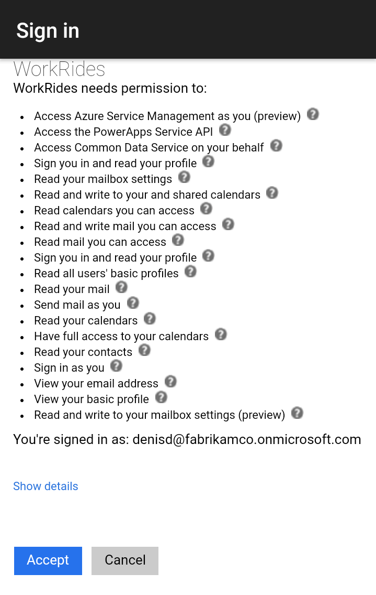


### Authentication
To enable work based authentication you will need to add the nuget package for [**A**ctive **D**irectory **A**uthentication **L**ibrary](https://github.com/AzureAD/azure-activedirectory-library-for-dotnet) and configure to work with Azure Active Directory using the client ID that was generated during application registration in Azure Portal.

The authentication process has been taken care in the app by **DependencyService** with trivial platform specific implementations. Invoking the **Authenticate** method will display an authentication dialog:

```csharp
private Task<AuthenticationResult> AccessToken()
{
    Task<AuthenticationResult> result = DependencyService.Get<IAuthenticator>()
            .Authenticate(AppSettings.GraphAuthorityUri, 
                          AppSettings.GraphApiEndpoint, 
                          AppSettings.CarpoolClientId, 
                          AppSettings.GraphRedirectUri);

    return result;
}
```

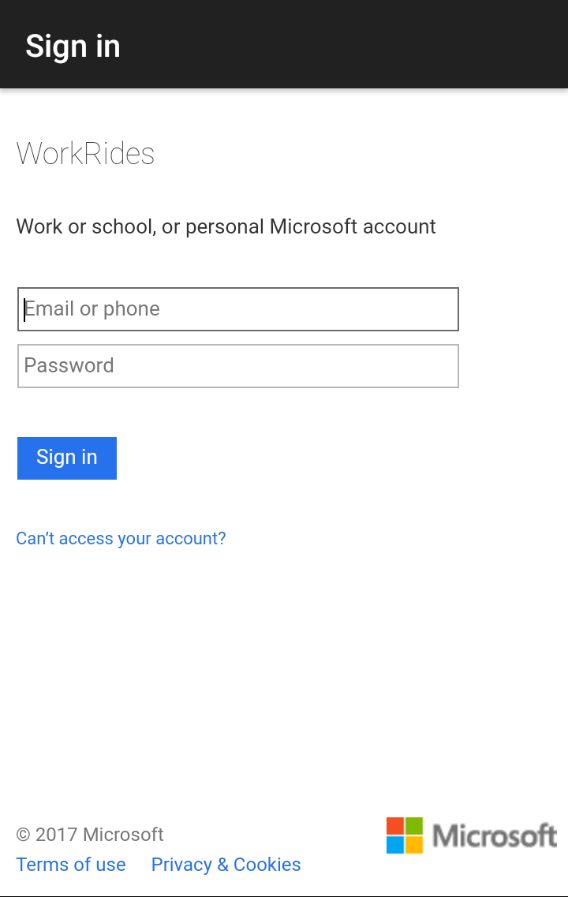

The sign out feature also has been implemented by **DependencyService**. The following code signs out an user. 

```csharp
public void SignOut()
{
    DependencyService.Get<IAuthenticator>().Signout(AppSettings.GraphAuthorityUri);
    ...
}
```

The configuration needed to authenticate with ADAL are defined in the **AppSettings** file available in the Portable Class Library. This properties are:

```csharp
// graph api key created on the App Registration section
public const string CarpoolClientId = "<GRAPH API KEY>";
// Graph API endpoint
public const string GraphApiEndpoint = "https://graph.microsoft.com/";
// A redirect uri gived to AAD on the app registration process. Usually http://localhost for native apps
public const string GraphRedirectUri = "http://workRides";
// URl for your Azure tenant 
public const string GraphAuthorityUri = "https://login.windows.net/<TENANT ID>";
```

#### Multiple authentication calls
The ADAL SDK allows the reuse of the authentication token for new authorization requests based on **AuthenticationContext.TokenCache**. In the WorkRides app, the same authentication token is used to provide access to the **Graph API** and to the **CDS API**.

```csharp
private Task<AuthenticationResult> AccessToken()
{
    Task<AuthenticationResult> result = DependencyService.Get<IAuthenticator>()
            .Authenticate(AppSettings.CdsAuthorityUri, 
                          AppSettings.CdsResourceUri, 
                          AppSettings.CarpoolClientId, 
                          AppSettings.CdsRedirectUri);

    return result;
}
```

### Calling Microsoft Graph
To access Microsoft Graph you can either use Microsoft Graph REST API or 
the client library. In WorkRides app we used [Microsoft Graph .NET Client Library](https://github.com/microsoftgraph/msgraph-sdk-dotnet). 

Some features included in the WorkRides applications have not been included into the sdk yet (ie: People API, getMailTips API). Hence we called the Microsoft Graph REST APIs using HttpClient and [NewtonSoft library](https://github.com/JamesNK/Newtonsoft.Json/).

The *GraphClient* singleton class in the app is used to access the Microsoft Graph functionality. The authentication process is using DelegateAuthenticationProvider, as described in the [library overview](https://github.com/microsoftgraph/msgraph-sdk-dotnet/blob/dev/docs/overview.md):

```csharp
Beta = new GraphServiceClient(
          "https://graph.microsoft.com/beta",
          new DelegateAuthenticationProvider(
            async (requestMessage) =>
            {
              var token = await GetTokenForUserAsync();
              requestMessage.Headers.Authorization = new AuthenticationHeaderValue("bearer", token);
            }));
```

Once you have completed authentication and have GraphClient initialized, you can begin to make calls to the Microsoft Graph service. The requests in the SDK follows the format of the Microsoft Graph API's RESTful syntax.

For example, to retrieve a list of users from my organization (i.e. GET /users):

```csharp
var result = await GraphClient.Instance.Beta.Users.Request().GetAsync();
```

Aditionally WorkRides uses [query parameters](https://developer.microsoft.com/en-us/graph/docs/overview/query_parameters) to control the result and the returned amount of data:
* Filter the query result with the *Filter* method
 (in REST $filter parameter is used for this). For example to obtain the users from my department.
* Control the amuont of data returned in the response using the *Select* method (in REST $select parameter is used for this).
* etc.

```csharp
var result = await GraphClient.Instance.Beta.Users.Request()
                .Filter($"department eq '{WebUtility.UrlEncode(department)}'")
                .Select("id,mail,displayName,givenName,jobTitle,department,businessPhones,mobilePhone,postalCode,streetAddress,state,userPrincipalName,city")
                .GetAsync();
```

### Calling Microsoft Common Data Service
The Xamarin app connects to the customer's Common Data Service environment to access data about employees and store driver and ride details data.  From the Xamarin app, we used the CDS SDK to interact with CDS. 

Documentation for the CDS SDK can be found at [Building apps with the Common Data Service](https://docs.microsoft.com/en-us/common-data-service/entity-reference/cds-sdk-home-page). Unfortunately the CDS SDK is currently not PCL compatible so it can't be called directly from a Xamarin app, so the CDS SDK code should be wrapped by a web API or a series of Azure Functions. In the future, we'll be working on a way to access CDS data from a Xamarin app in a single step.  
In the sample, a web API has been built. The interaction with CDS from the Xamarin App is therefore:
*Xamarin App* > *Web API* > *CDS SDK* > *CDS*

The Web API can be seen in the *CarPool.WebApp* project. An example of the SDK code in the web API can be seen in the *CarPool.WebApp.Controllers.EmployeeController* class.

A good example of the calls to the CDS SDK can be seen in the *Get* method:
```csharp
public async Task<IEnumerable<Employee>> Get()
{
    //Get CDS SDK reference ready to communicate with CDS environment
    using (Client client = await CdsHelper.CreateClientAsync(this.Request))
    {
        //Build query
        DataRangeSkipClauseBuilder<CarPool.Web.Library.Employee> query = client.GetRelationalEntitySet<CarPool.Web.Library.Employee>()
                    .CreateQueryBuilder()
                    .Project(pc => pc
                                    .SelectField(f => f.PrimaryId)
                                    .SelectField(f => f.FullName)
                                    .SelectField(f => f.HomeAddress)
                                    .SelectField(f => f.WorkAddress)
                                    .SelectField(f => f.PreferredArrivalTimeAtWork)
                                    .SelectField(f => f.PreferredDepartureTimeFromWork)
                                    .SelectField(f => f.Email)
                                    .SelectField(f => f.Phone)
                                    .SelectField(f => f.BusinessUnit)
                                    .SelectField(f => f.HomeLatitude)
                                    .SelectField(f => f.HomeLongitude)
                                    .SelectField(f => f.WorkLatitude)
                                    .SelectField(f => f.WorkLongitude)
                                );

        //Execute query
        OperationResult<IReadOnlyList<CarPool.Web.Library.Employee>> queryResult = null;
        await client.CreateRelationalBatchExecuter(RelationalBatchExecutionMode.Transactional)
            .Query(query, out queryResult)
            .ExecuteAsync();

        //Transform query results
        var employees = new List<Employee>();
        foreach (var entry in queryResult.Result)
        {
            employees.Add(CDSEmployeeToAppEmployee(entry));
        }
        return employees;
    }
}
```

The code that calls the Web API can be seen in the *CarPool.Clients.Core* project. Specifically the *CarPool.Clients.Core.Services.Data.CDSDataProvider* class contains all the Web API interaction code.

A good example of the calls to the Web API can be seen in the *GetAllEmployeesAsync* and *GetAllRecordsAsync* methods:

```csharp
public async Task<IEnumerable<Employee>> GetAllEmployeesAsync()
{
    return await GetAllRecordsAsync<Employee>(EmployeeAPI);
}

private async Task<IEnumerable<T>> GetAllRecordsAsync<T>(string api)
{
    //Prepare to make HTTP request
    var client = new HttpClient();
    client.DefaultRequestHeaders.Authorization = this.AuthHeader;

    //Build URI string with web API as the base and the specific API added as a suffix
    var uriString = serviceApiUri + api;

    client.DefaultRequestHeaders.Accept.Add(new MediaTypeWithQualityHeaderValue(ApplicationJSON));

    //Make GET request and capture response
    HttpResponseMessage response = await client.GetAsync(uriString);
    var responseString = await response.Content.ReadAsStringAsync();

    //Transform JSON response into array of data model objects
    var results = JsonConvert.DeserializeObject<T[]>(responseString);

    return results;
}
```

For more details about CDS, consult the [separate readme document for CDS](../cds/README.md). 

Key documentation:
- [Get started with the Common Data Service SDK](https://docs.microsoft.com/en-us/common-data-service/entity-reference/cds-sdk-get-started)
- [Building apps with the Common Data Service](https://docs.microsoft.com/en-us/common-data-service/entity-reference/cds-sdk-home-page)
- [Get started with the Common Data Service SDK via Azure Functions](https://docs.microsoft.com/en-us/common-data-service/entity-reference/cds-sdk-azure-functions-get-started)

### Maps services
The WorkRides app use Maps services to calculate and display the user routes and also to geocode the user home/work address to geopositions.

The map service uses native APIs for each platform. i.e.

* Android: Google Maps API is used. You should provide a valid [directions gmaps api key](https://developer.xamarin.com/guides/android/platform_features/maps_and_location/maps/obtaining_a_google_maps_api_key/). This key must be configured in the **AppSettings.GoogleMapsAPIKey** field.

```csharp
public const string GoogleMapsAPIKey = "<GMAPS API KEY>";
```

Also must be configured in the **Properties/AndroidManifest.xml** file.

```xml
<application android:label="CarPool" android:largeHeap="true">
   <meta-data android:name="com.google.android.maps.v2.API_KEY" android:value="GMAPS API KEY" />
</application>
```

* iOS: iOS Maps API is used. It's provided directly by the device.

* UWP: Bing Maps API is used. You should provide a valid [bing api key](https://msdn.microsoft.com/es-es/library/ff428642.aspx). This key must be configured in the **AppSettings.BingMapsAPIKey** field.

```csharp
public const string BingMapsAPIKey = "<BING API KEY>";
```

### Maps Geocoding services

Aditionally to the maps service to display the map and calculate the route, must be added a key to the geocoder api of google maps. You can obtain an api key [here](https://developers.google.com/maps/documentation/geocoding/get-api-key?hl=es-419).


## Clean and Rebuild
If you see build issues when pulling updates from the repo, try cleaning and rebuilding the solution.

## Copyright and license
* Code and documentation copyright 2017 Microsoft Corp. Code released under the [MIT license](https://opensource.org/licenses/MIT).

## Code of Conduct 
This project has adopted the [Microsoft Open Source Code of Conduct](https://opensource.microsoft.com/codeofconduct/). For more information see the [Code of Conduct FAQ](https://opensource.microsoft.com/codeofconduct/faq/) or contact [opencode@microsoft.com](mailto:opencode@microsoft.com) with any additional questions or comments.
