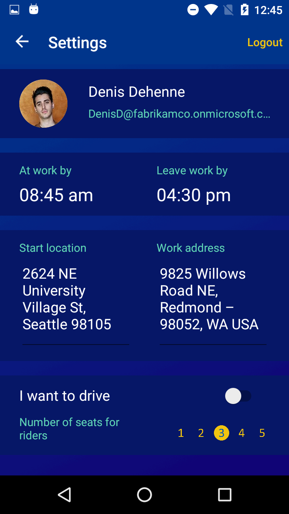
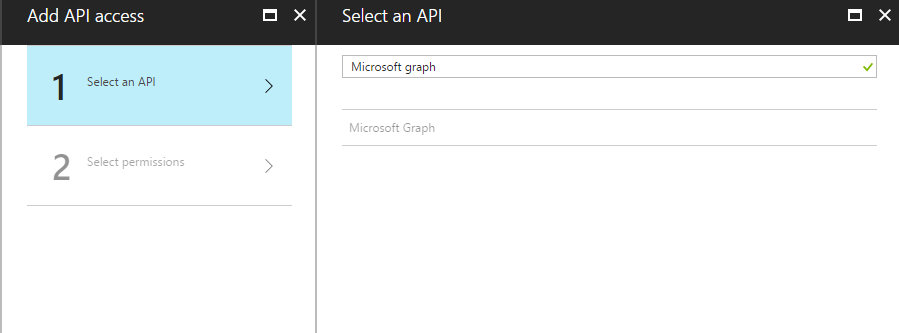
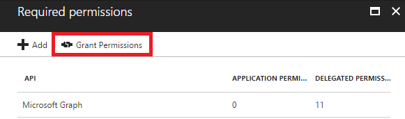
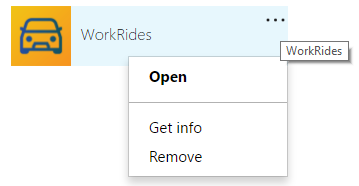

# CarPool Xamarin App

Mobile App that connects people to carpool to work. Users can sign in to the app using their work identities (AAD), able to carpool with interested employees who are with in their org or out side their org or the people they closely work with. 

Demonstrates that developers are able to build rich, people centric and data rich apps with their platform of choice using Microsoft APIs.




## Requirements
* Windows 10
* [Visual Studio __2015__](https://www.visualstudio.com/en-us/products/vs-2015-product-editions.aspx) Update 3 (14.0 or higher) to compile C# 6 language features (or Visual Studio MacOS) or Visual Studio 2017
* Xamarin add-ons for Visual Studio 3.2.1.64 or higher (available via the Visual Studio installer)
* __Visual Studio Community Edition is fully supported!__
* [Android SDK Tools](https://developer.android.com/studio/releases/sdk-tools.html) 25.2.3 or higher

## Xamarin App

This project exercises the following platforms, frameworks or features:

* Xamarin.Forms
  * XAML
  * Bindings
  * Converters
  * Central Styles
  * Custom Renderers
  * Animations
  * IoC
  * Messaging Center
  * Custom Controls
  * Cross Plugins

### Three platforms
The app targets **three** platforms:

* iOS (include WatchOS App)
* Android
* Universal Windows Platform (UWP)
    * UWP supported only in Visual Studio, not Xamarin Studio

As of 06/05/2017, WorkRides features 88.6% code share (11% iOS / 11.2% Android / 11.6% Windows).


## Setup

**Download** or clone the repository. There are a solution with seven projects.

**Rebuild** the solution to get all necessary **NuGet** packages.

Access to **AppSettings.cs** file available in the Portable Class Library to introduce your Azure endpoints and APIs keys.

### App Registration

To integrate a Xamarin app with your work Azure AD firstly you must [register it as an authorized application](https://docs.microsoft.com/en-us/azure/active-directory/develop/active-directory-integrating-applications) in your directory:

* Sign in to the [Azure portal](https://portal.azure.com).
* Choose your Azure AD tenant by selecting your account in the top right corner of the page.
* In the left-hand navigation pane, choose More Services, click App Registrations, and click Add.
* Create a new **Native** application with your preferred name. For native applications usually the redirect uri is configured to http://localhost.

Once the app have been created, Azure assigned an unique id called **Application ID** (ie.: Application ID : c8c39d80-e4ad-4e07-86af-de46afcf4b56). This ID will be used in next step in the app configuration.

#### Required permissions for Microsoft Graph

Once the app has been created on Azure AD, permissions must be provided to allow the access from WorkRides to the different information it needs. To access to the Graph API, we must add the permission to **Microsoft Graph**.



The required permissions from WorkRides to work with the graph apis are:

* Permissions to sign in with AAD
  * Sign users in (*openid*)
  * Sign in and read user profile (*User.Read*)
*  Permissions to read other users from the Azure AD
  *  Read all users' basic profiles (*User.ReadBasic.All*)
* Permissions to create and read Calendar events
  * Have full access to user calendars (*Calendars.ReadWrite*)
  * Read user and shared calendars (*Calendars.Read.Shared*)
* Permissions used to Fetch Out Of Office (OOF)
  * Read user mailbox settings (*MailboxSettings.Read*)
  * Read user mail (*Mail.Read*)
  * Read user and shared mail (*Mail.Read.Shared*)
* Permissions to send emails
  * Send email as a user (*Mail.Send*)

A detailed information about permissions and their allowed actions can be found on the [Graph API documentation](https://developer.microsoft.com/en-us/graph/docs/authorization/permission_scopes).

#### Required permissions for Common Data Service
To access to the Common Data Service API, we must also add the permission to **PowerApps Runtime Service** and **Windows Azure Service Management API**.

The required permissions from WorkRides to work with the CDS APIs are:

* PowerApps Runtime Service
  * All
* Windows Azure Service Management API
  * All

Detailed information about application registration for an app that will interact with CDS can be found in [Get started with the Common Data Service SDK - Application registration](https://docs.microsoft.com/en-us/common-data-service/entity-reference/cds-sdk-get-started#application-registration-1)

#### Grant Permissions

The first time the user authenticate into the app, he will be prompt with a dialog to grant permission to the permissions we selected previously. 


As an AAD Administrator, if you want to allow the application for the entire organization so the user can access without visualize the consent dialog, you can **Grant permissions**.



#### Revoke Permissions

As an user of the application, if you agreed with the consent dialog but actually you want revoke your consent, you can enter into your [Access Panel Applications Portal](https://myapps.microsoft.com) and remove the application.



If the application was granted by an administrator, the app won't appear in the Apps panel.

### Authentication

The authentication have been implemented using the [ADAL Library](https://github.com/AzureAD/azure-activedirectory-library-for-dotnet).

The authentication process have been integrated as a **DependencyService** with different platform implementations. The invocation of the **Authenticate** method will display an authentication dialog:

```csharp
private Task<AuthenticationResult> AccessToken()
{
    Task<AuthenticationResult> result = DependencyService.Get<IAuthenticator>()
            .Authenticate(AppSettings.GraphAuthorityUri, 
                          AppSettings.GraphApiEndpoint, 
                          AppSettings.CarpoolClientId, 
                          AppSettings.GraphRedirectUri);

    return result;
}
```


The sign out process also is implemented in the **DependencyService**. It delete the ADAL sdk Cache to force the user to authenticate. 

```csharp
public void SignOut()
{
    DependencyService.Get<IAuthenticator>().Signout(AppSettings.GraphAuthorityUri);
    ...
}
```

The configuration needed to authenticate with ADAL are defined in the **AppSettings** file available in the Portable Class Library. This properties are:

```csharp
// graph api key created on the App Registration section
public const string CarpoolClientId = "<GRAPH API KEY>";
// Graph API endpoint
public const string GraphApiEndpoint = "https://graph.microsoft.com/";
// A redirect uri gived to AAD on the app registration process. Usually http://localhost for native apps
public const string GraphRedirectUri = "http://workRides";
// URl for your Azure tenant 
public const string GraphAuthorityUri = "https://login.windows.net/<TENANT ID>";
```

#### Multiple authentication calls

The ADAL SDK allow the reuse of the authentication token for new authorization requests based on a **AuthenticationContext.TokenCache**. In the WorkRides app, the same authentication token is used to provide access to the **Graph API** and to the **CDS API**.

```csharp
private Task<AuthenticationResult> AccessToken()
{
    Task<AuthenticationResult> result = DependencyService.Get<IAuthenticator>()
            .Authenticate(AppSettings.CdsAuthorityUri, 
                          AppSettings.CdsResourceUri, 
                          AppSettings.CarpoolClientId, 
                          AppSettings.CdsRedirectUri);

    return result;
}
```

### Calling Graph

The integration with the graph api have been implemented using [Microsoft Graph .NET Client Library](https://github.com/microsoftgraph/msgraph-sdk-dotnet). 

Some features included in the WorkRides applications have not been included into the sdk yet (ie: people api, getMailTips api). This use cases have been implemented using HttpClient and [NewtonSoft library](https://github.com/JamesNK/Newtonsoft.Json/).

The key of the Graph usage was the *GraphClient* class singleton instance that provide a single point to the authenticated user token,. The authentication process is using a  DelegateAuthenticationProvider, as described in the [library overview](https://github.com/microsoftgraph/msgraph-sdk-dotnet/blob/dev/docs/overview.md):

```csharp
Beta = new GraphServiceClient(
          "https://graph.microsoft.com/beta",
          new DelegateAuthenticationProvider(
            async (requestMessage) =>
            {
              var token = await GetTokenForUserAsync();
              requestMessage.Headers.Authorization = new AuthenticationHeaderValue("bearer", token);
            }));
```

Once you have completed authentication and have GraphClient initialized, you can begin to make calls to the service. The requests in the SDK follow the format of the Microsoft Graph API's RESTful syntax.

For example, to retrieve a list of users from my organization (GET /users):

```csharp
var result = await GraphClient.Instance.Beta.Users.Request().GetAsync();
```

Aditionally WorkRides uses [query parameters](https://developer.microsoft.com/en-us/graph/docs/overview/query_parameters) to control the result and the returned amount of data:
* Filter the query result with the *Filter* method
 (in REST is provided by the $filter parameter). For example to obtain the users from my department.
* Control the amuont of data returned in the response using the *Select* method (in REST is provided by the $select parameter).
* etc.

```csharp
var result = await GraphClient.Instance.Beta.Users.Request()
                .Filter($"department eq '{WebUtility.UrlEncode(department)}'")
                .Select("id,mail,displayName,givenName,jobTitle,department,businessPhones,mobilePhone,postalCode,streetAddress,state,userPrincipalName,city")
                .GetAsync();
```


### Maps services

The WorkRides app use Maps services to calculate and display the user routes and also to geocode the user home/work address to geopositions.

The map service is based on the native approach for each platform.

* Android: Using Google maps api. You should provide a valid [directions gmaps api key](https://developer.xamarin.com/guides/android/platform_features/maps_and_location/maps/obtaining_a_google_maps_api_key/). This key must be configured in the **AppSettings.GoogleMapsAPIKey** field.

```csharp
public const string GoogleMapsAPIKey = "<GMAPS API KEY>";
```

Also must be configured in the **Properties/AndroidManifest.xml** file.

```xml
<application android:label="CarPool" android:largeHeap="true">
   <meta-data android:name="com.google.android.maps.v2.API_KEY" android:value="GMAPS API KEY" />
</application>
```

* iOS: Using iOS maps api. It's provided directly by the device.

* UWP: Using Bing maps api. You should provide a valid [bing api key](https://msdn.microsoft.com/es-es/library/ff428642.aspx). This key must be configured in the **AppSettings.BingMapsAPIKey** field.

```csharp
public const string BingMapsAPIKey = "<BING API KEY>";
```


*Enjoy!*

## Clean and Rebuild
If you see build issues when pulling updates from the repo, try cleaning and rebuilding the solution.

## Copyright and license
* Code and documentation copyright 2017 Microsoft Corp. Code released under the [MIT license](https://opensource.org/licenses/MIT).

## Code of Conduct 
This project has adopted the [Microsoft Open Source Code of Conduct](https://opensource.microsoft.com/codeofconduct/). For more information see the [Code of Conduct FAQ](https://opensource.microsoft.com/codeofconduct/faq/) or contact [opencode@microsoft.com](mailto:opencode@microsoft.com) with any additional questions or comments.